# Store Rating System

A comprehensive full-stack web application for rating and managing stores, built with Express.js, React.js, and MySQL.
🚀 **Live Deployed Project Link**: [RateStore] [https://virtuous-abundance-production.up.railway.app/login]

## 📱 Application Screenshots

### 🔐 Authentication System
.png)
*Role-based registration system - Users can register as Normal User, Store Owner, or Admin*

.png)
*Secure login system with role-based authentication*

### 👤 User Dashboard & Experience
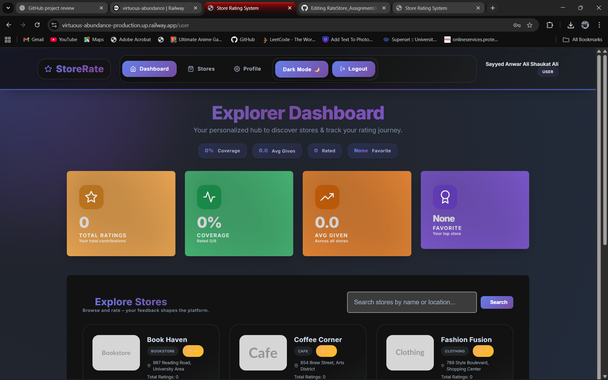
*User dashboard showing store browsing and rating capabilities*

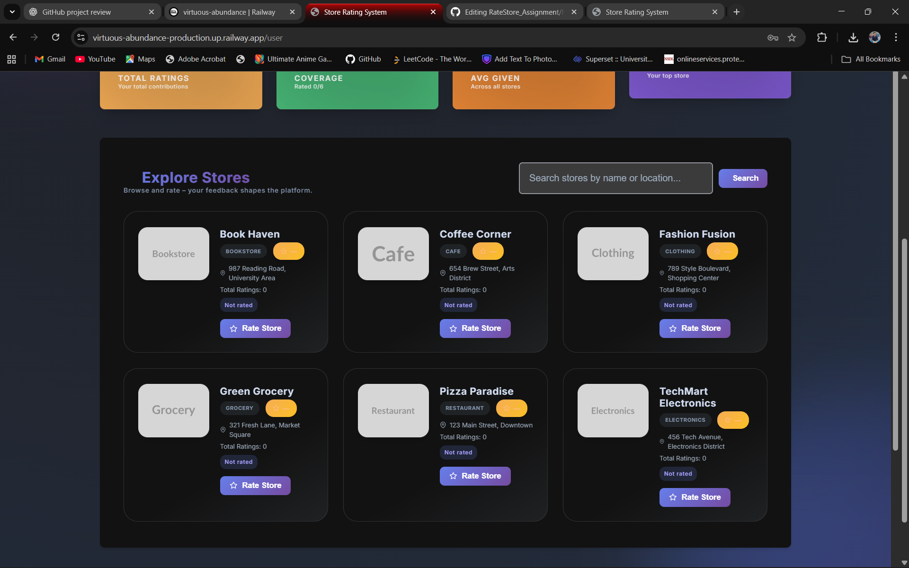
*Enhanced user interface with comprehensive store listings*

### 👨‍💼 Admin Dashboard & Management
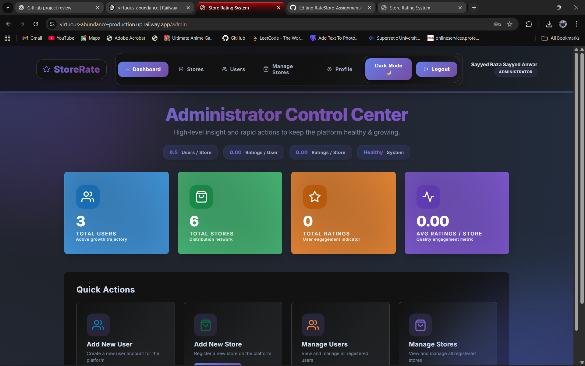
*Admin dashboard with system overview and management tools*

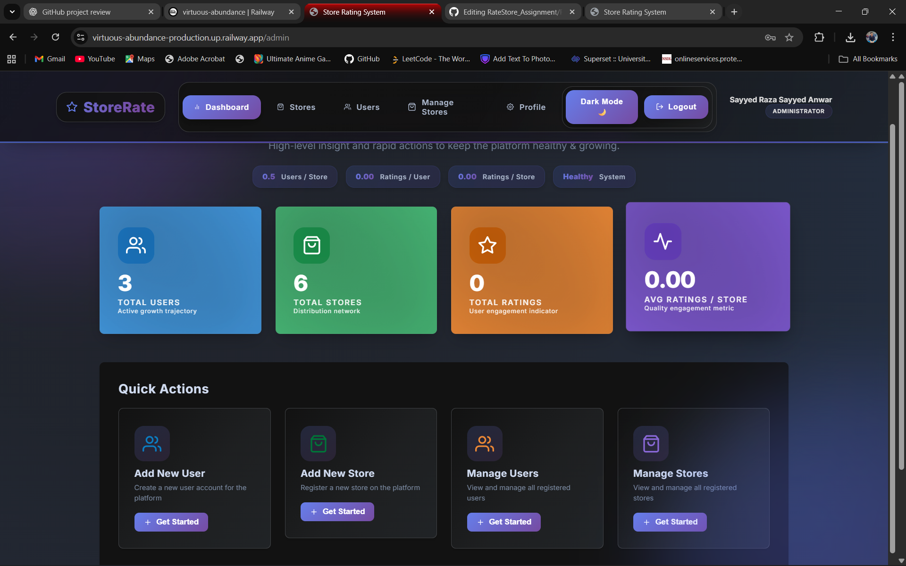
*Comprehensive admin interface with user and store statistics*

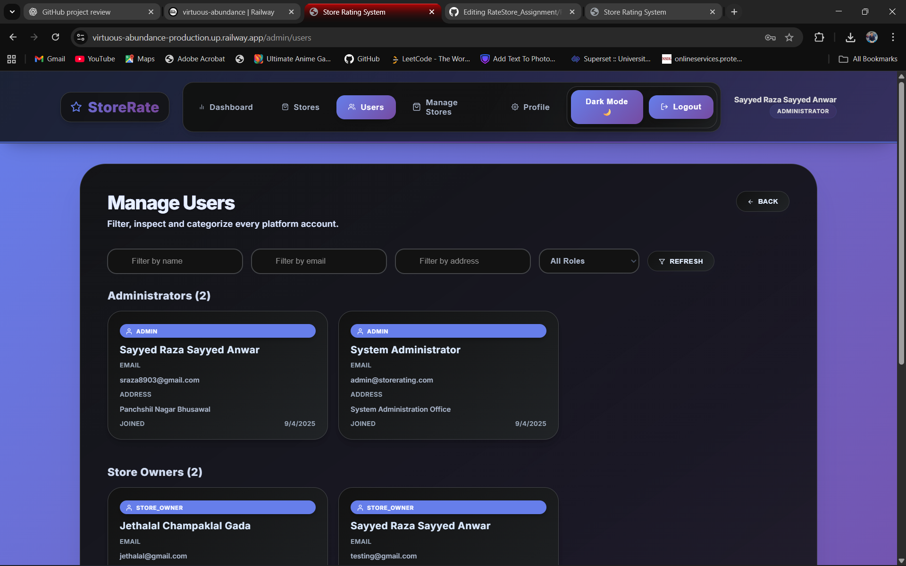
*Admin user management interface with filtering capabilities*

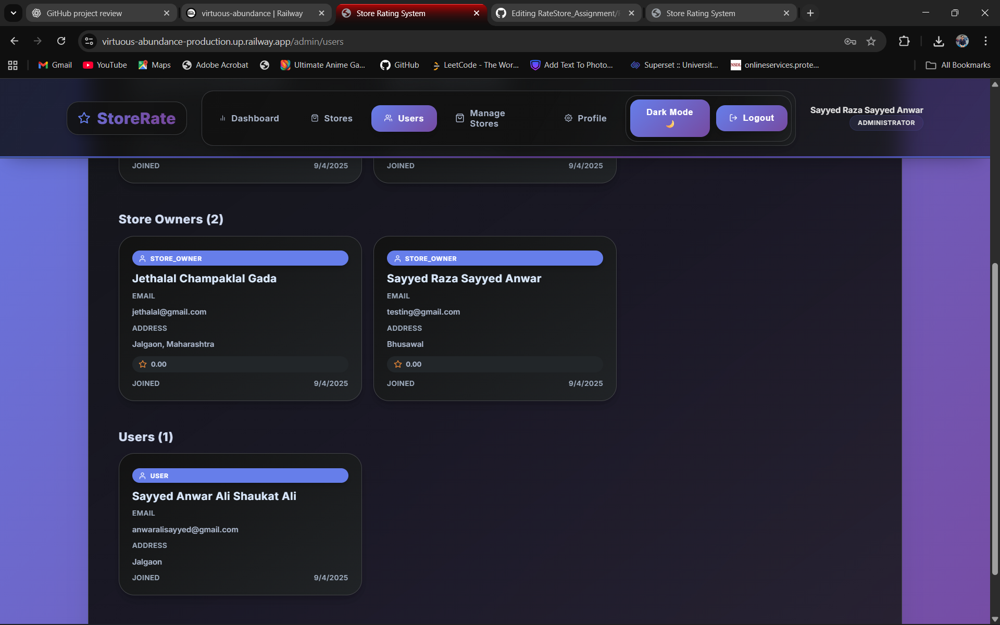
*Advanced user management with detailed user information*

### 🏪 Store Owner Dashboard
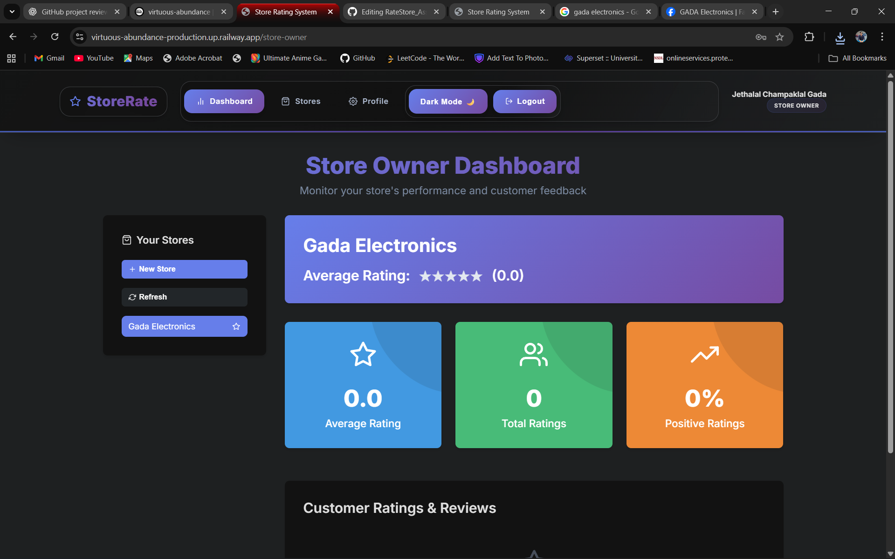
*Store owner dashboard showing store performance and customer ratings*

### 👤 Profile Management System
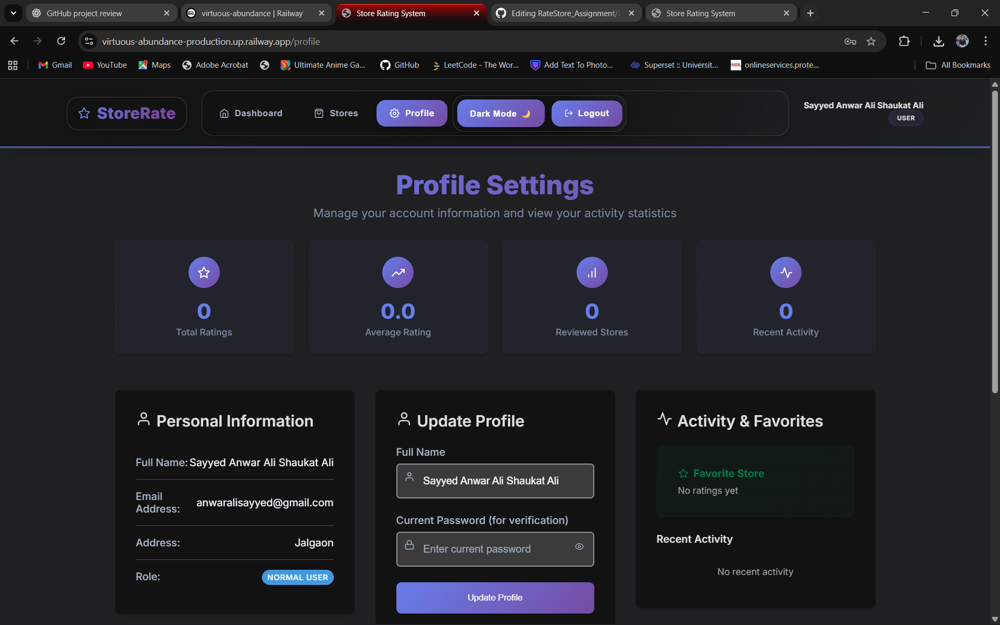
*User profile interface with personal information and statistics*

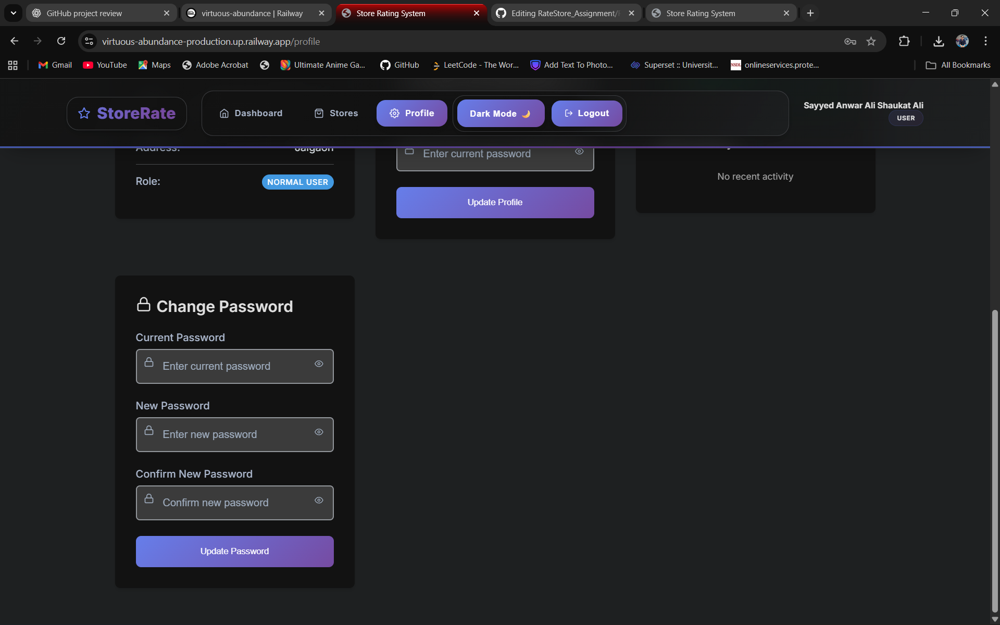
*Comprehensive profile management with rating history*

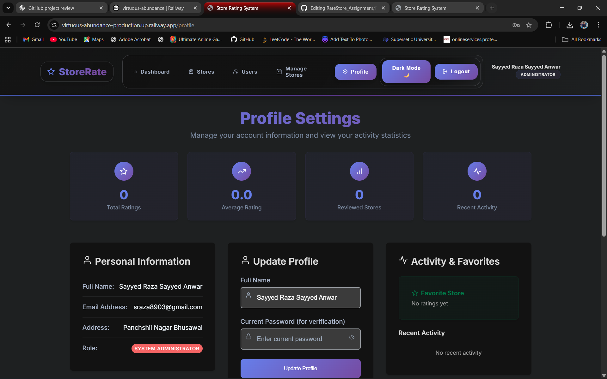
*Admin profile interface with system administration options*

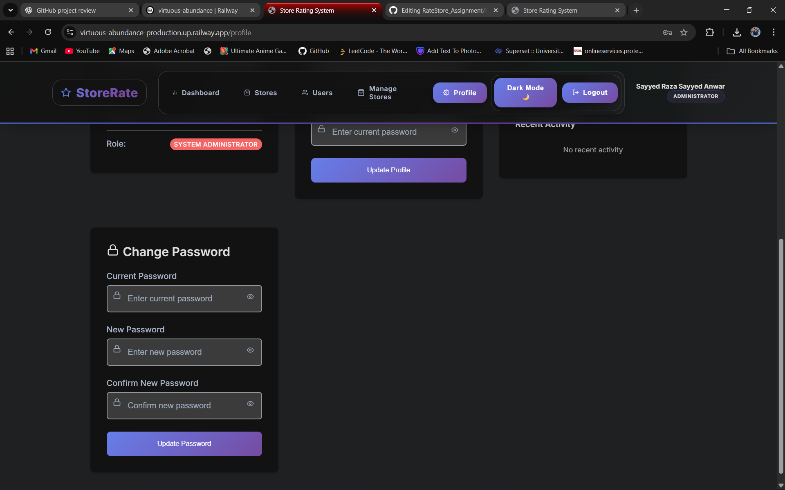
*Enhanced admin profile with complete system access*

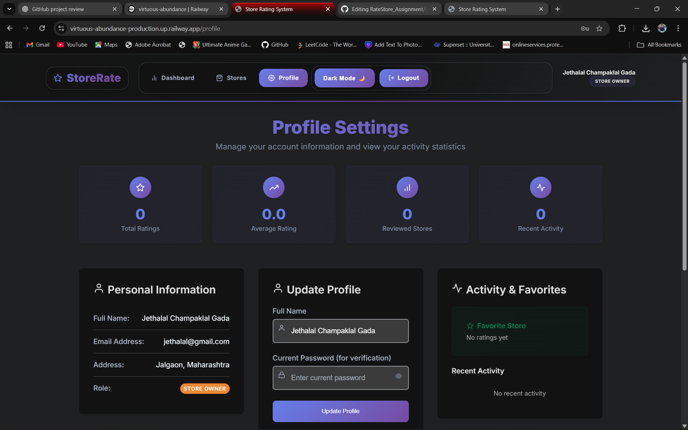
*Store owner profile management interface*

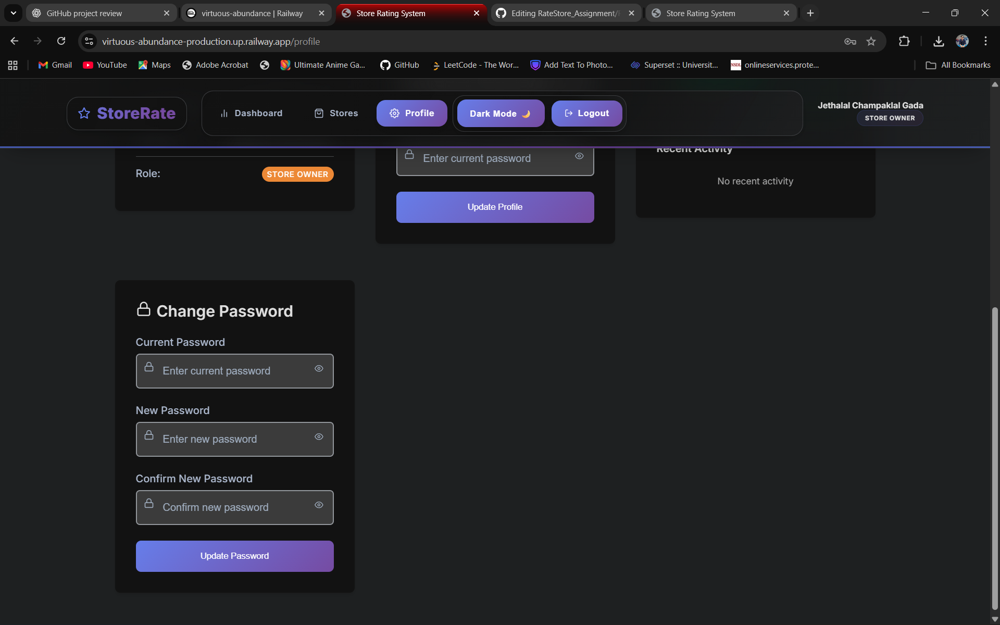
*Comprehensive store owner profile with business details*

### 🏪 Store Browsing & Management
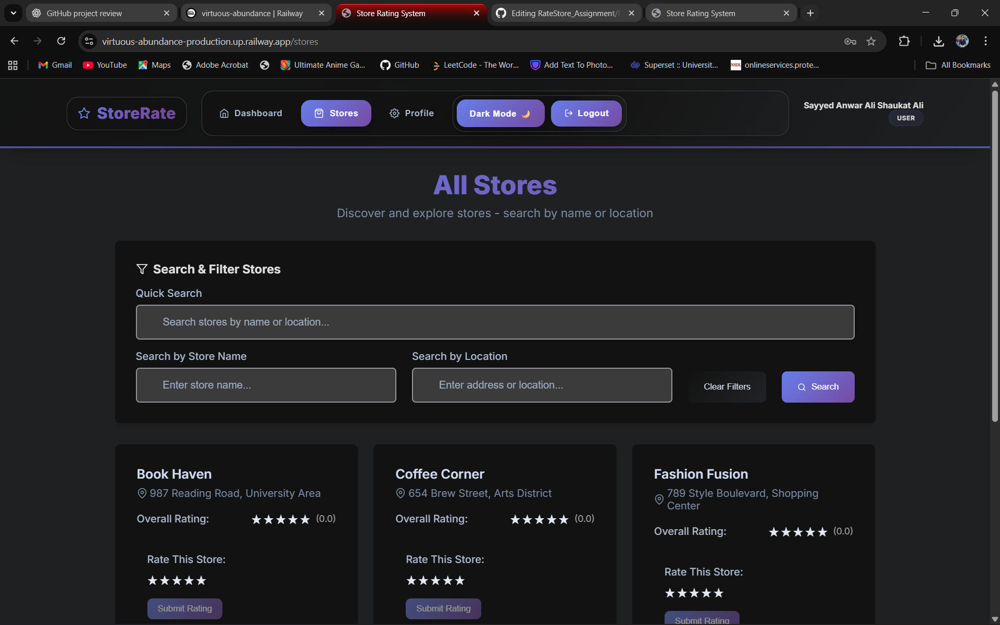
*Store browsing interface with search and filtering capabilities*

### 🌙 Theme Support
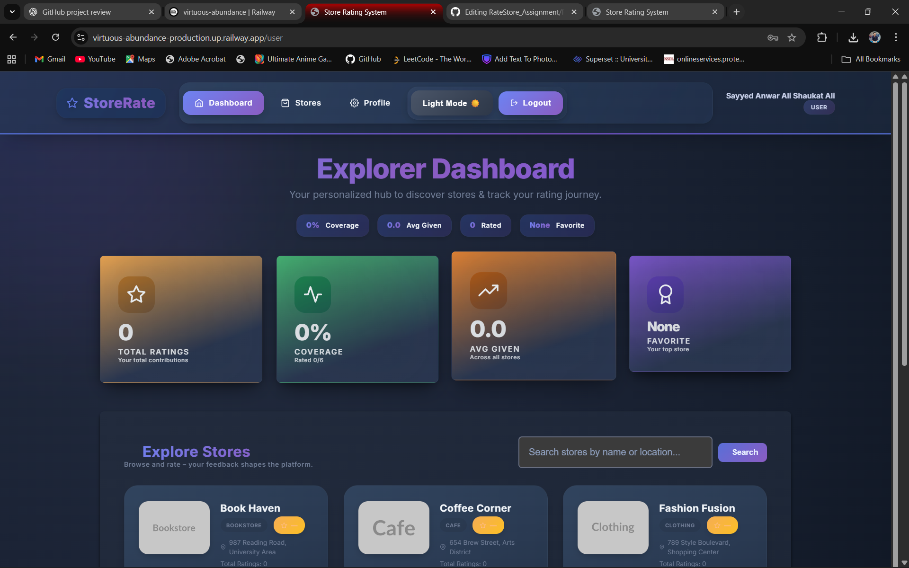
*Application supports both light and dark themes for better user experience*


## Features
### User Roles & Functionalities

#### System Administrator
- **Dashboard**: View total users, stores, and ratings
- **User Management**: Add, view, and filter users
- **Store Management**: Add, view, and filter stores
- **Comprehensive Filtering**: Filter by name, email, address, and role
- **User Details**: View detailed user information including store ratings for store owners

#### Normal User
- **Registration & Authentication**: Sign up and log in
- **Store Browsing**: View all registered stores with search and filter capabilities
- **Rating System**: Submit and modify ratings (1-5 stars) for stores
- **Password Management**: Update password after login

#### Store Owner
- **Dashboard**: View store performance metrics
- **Ratings Overview**: See all customers who rated their store
- **Average Rating**: Monitor store's overall rating
- **Customer Details**: View names, emails, and individual ratings

### Security Features
- JWT-based authentication
- Role-based access control
- Password hashing with bcrypt
- Input validation and sanitization
- Rate limiting
- CORS protection
- Helmet.js security headers

### Form Validations
- **Name**: 20-60 characters
- **Address**: Maximum 400 characters
- **Password**: 8-16 characters with uppercase and special character
- **Email**: Standard email validation

## Technology Stack

### Backend
- **Node.js** with Express.js
- **MySQL** database
- **JWT** for authentication
- **bcryptjs** for password hashing
- **express-validator** for input validation
- **helmet** for security headers
- **cors** for cross-origin resource sharing

### Frontend
- **React.js** with hooks
- **React Router** for navigation
- **Styled Components** for styling
- **Framer Motion** for animations
- **React Hook Form** with Yup validation
- **React Toastify** for notifications
- **Axios** for API calls

## Project Structure

```
store-rating-system/
├── backend/
│   ├── src/
│   │   ├── config/
│   │   │   └── database.js
│   │   ├── controllers/
│   │   │   ├── authController.js
│   │   │   ├── adminController.js
│   │   │   ├── userController.js
│   │   │   └── storeOwnerController.js
│   │   ├── middleware/
│   │   │   ├── auth.js
│   │   │   └── validation.js
│   │   ├── models/
│   │   ├── routes/
│   │   │   ├── auth.js
│   │   │   ├── admin.js
│   │   │   ├── user.js
│   │   │   └── storeOwner.js
│   │   └── server.js
│   ├── .env
│   └── package.json
├── frontend/
│   ├── public/
│   ├── src/
│   │   ├── components/
│   │   │   ├── Navbar.js
│   │   │   ├── ProtectedRoute.js
│   │   │   └── StarRating.js
│   │   ├── context/
│   │   │   └── AuthContext.js
│   │   ├── pages/
│   │   │   ├── admin/
│   │   │   ├── user/
│   │   │   ├── storeOwner/
│   │   │   ├── Login.js
│   │   │   ├── Register.js
│   │   │   ├── Profile.js
│   │   │   └── Unauthorized.js
│   │   ├── services/
│   │   │   └── api.js
│   │   ├── styles/
│   │   │   └── GlobalStyles.js
│   │   ├── utils/
│   │   │   ├── helpers.js
│   │   │   └── validationSchemas.js
│   │   ├── App.js
│   │   └── index.js
│   └── package.json
└── README.md
```


## Features Implemented

✅ **Authentication & Authorization**
- JWT-based authentication
- Role-based access control
- Password validation and hashing

✅ **User Management**
- User registration with validation
- Admin can create users with different roles
- Comprehensive user listing with filters

✅ **Store Management**
- Store registration and management
- Store listing with search capabilities
- Store owner assignment

✅ **Rating System**
- 1-5 star rating system
- Users can submit and modify ratings
- Average rating calculation
- Rating display with star components

✅ **Dashboard & Analytics**
- Admin dashboard with statistics
- Store owner dashboard with performance metrics
- User dashboard for store browsing

✅ **Security & Validation**
- Input validation on both frontend and backend
- SQL injection prevention
- XSS protection
- Rate limiting

✅ **Responsive Design**
- Mobile-friendly interface
- Modern, colorful UI
- Smooth animations and transitions

## 👨‍💻 Developer

**Sayyed Raza**  
- GitHub: [@SayyedRaza786](https://github.com/SayyedRaza786)
- Repository: [RateStore_Assignment](https://github.com/SayyedRaza786/RateStore_Assignment)

---

